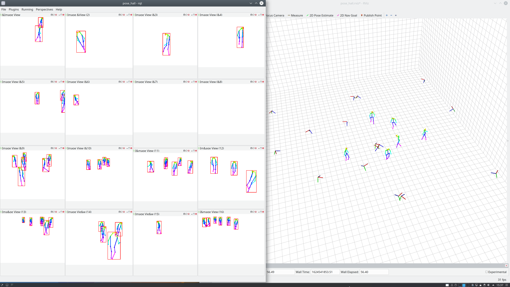

# SmartEdgeSensor3DHumanPose
In this repo we publish the code for the paper:<br>
"Real-Time Multi-View 3D Human Pose Estimation using Semantic Feedback to Smart Edge Sensors"

## Citation
If you use this code for your research, please cite the following paper:

Simon Bultmann and Sven Behnke<br>
*Real-Time Multi-View 3D Human Pose Estimation using Semantic Feedback to Smart Edge Sensors*<br>
Accepted for Robotics: Science and Systems (RSS), July 2021.

## Installation
### Dependencies
The code was tested with ROS melodic and Ubuntu 18.04.

The `pose_prior` package depends on the [gtsam library](https://github.com/borglab/gtsam).
You can install it as follows (outside of catkin workspace)
```
git clone https://github.com/borglab/gtsam.git
cd gtsam
git checkout tags/4.0.3
mkdir build
cd build
cmake ..
make
sudo make install
```

### ROS packages
Clone this repo inside your catkin workspace:
```
cd catkin_ws/src
git clone https://github.com/AIS-Bonn/SmartEdgeSensor3DHumanPose.git
cd ..
catkin build --cmake-args -DCMAKE_BUILD_TYPE=Release
source devel/setup.bash
```

## Demo
Get the sample data from [here](https://uni-bonn.sciebo.de/s/A00aklgwgyWBRS5).\
Start `rqt` with the included perspective `pose_hall.perspective`.\
Start `rviz` with the included perspective `pose_hall.rviz`.\
Run the launchfile: `roslaunch pose_prior pose_triangulate_demo.launch`.\
Playback the bag file: `rosbag play poses2D_16cam.bag`.

The 2D poses are rendered in the rqt window and the estimated triangulated 3D skeletons displayed in rviz, as in the picture below.

Note: Enough processing power is needed to process the 16 camera views and 6 people in real time. If a lot of warnings about "Large frame delay..." occur, try playing back the bag-file in reduced speed.


## Credits
We use code from other open-source software libraries in our implementation:

The `skeleton_3d` package extends parts of the [OpenPose 3D library](https://github.com/CMU-Perceptual-Computing-Lab/openpose/blob/master/doc/advanced/3d_reconstruction_module.md) for multi-view triangulation.\
Cao, Zhe, et al. "OpenPose: Realtime Multi-Person 2D Pose Estimation using Part Affinity Fields." IEEE Transactions on Pattern Analysis and Machine Intelligence 43.1 (2019): 172-186.

The multi-person data association is based on: [Tanke, Julian, and Juergen Gall. "Iterative Greedy Matching for 3D Human Pose Tracking from Multiple Views." German Conference on Pattern Recognition, 2019](https://github.com/jutanke/mv3dpose).

We use a public implementation of the Hungarian algorithm from [https://github.com/mcximing/hungarian-algorithm-cpp](https://github.com/mcximing/hungarian-algorithm-cpp).
